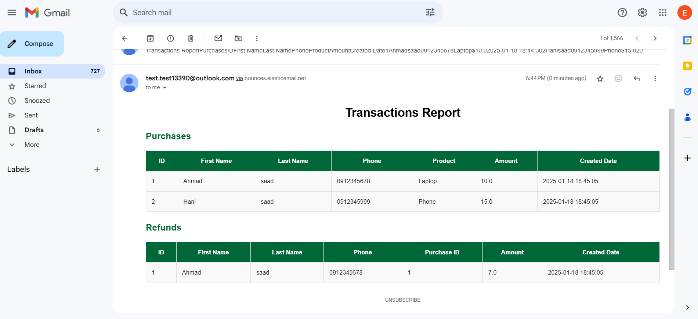

# Purchase Management System

A Spring Boot application for managing purchases and refunds with automated daily report generation and email notifications.

## 🚠 Technologies

- Java 21.0.5
- Spring Boot 3.2.0
- Spring Data JPA
- PostgreSQL
- Lombok
- Spring Mail
- HTML/CSS for reports

## 🚀 Quick Start Guide

### Prerequisites
- Java 17 or higher
- PostgreSQL 12 or higher
- Maven (or use included mvnw)
- Git

### 1. Database Setup
```sql
-- Create PostgreSQL database
CREATE DATABASE taskdb;
CREATE USER task WITH PASSWORD 'p@ssw0rd';
GRANT ALL PRIVILEGES ON DATABASE taskdb TO task;
```

### 2. Clone & Configure
```bash
# Clone repository
git clone https://github.com/Samo-ama/purchase-management.git
cd purchase-management

# Configure database in application.yml
spring:
  datasource:
    url: jdbc:postgresql://localhost:5432/taskdb
    username: task
    password: p@ssw0rd
```

### 3. Email Configuration (Required)
1. Sign up at [ElasticEmail](https://elasticemail.com)
2. Get your API key
3. Update `application.yml`:
```yaml
spring:
  mail:
    host: smtp.elasticemail.com
    port: 2525
    username: your-mail@gmail.com         # ElasticEmail Username
    password: 2A5FF5C4131477E0A9B3DCBB4B223C0F0FB5    # Password key
    properties:
      mail:
        smtp:
          auth: true
          starttls:
            enable: true
    from: your-verified@elasticemail.com    # Must be verified in ElasticEmail
    to: recipient@example.com
```

### 4. Application Configuration
Create `application.yml`:
```yaml
server:
  port: 8080

spring:
  # Database
  datasource:
    url: jdbc:postgresql://localhost:5432/taskdb
    username: task
    password: p@ssw0rd
    driver-class-name: org.postgresql.Driver

  # JPA
  jpa:
    hibernate:
      ddl-auto: update
    properties:
      hibernate:
        dialect: org.hibernate.dialect.PostgreSQLDialect
    show-sql: true

  # Security (Basic Auth)
  security:
    user:
      name: test
      password: test

  # Email (ElasticEmail configuration)
  mail:
    host: smtp.elasticemail.com
    port: 2525
    username: your-username
    password: your-api-key
    properties:
      mail:
        smtp:
          auth: true
          starttls:
            enable: true
    from: your-verified@elasticemail.com
    to: recipient@example.com
```

### 5. Run Application
```bash
./mvnw spring-boot:run
```

### 6. Verify Installation
- Application runs on: `http://localhost:8080`
- Database seeder will automatically populate sample data
- Daily reports will be sent to configured email

## 🔍 API Testing

### Using Postman
1. Set Basic Auth:
   - Username: test
   - Password: test

## 🔍 Troubleshooting

### Common Issues

**Email Not Sending**
```plaintext
Solution: Verify ElasticEmail credentials and sender email is verified
```

### Sample Data
The seeder creates:
- 2 Customers
- 2 Products
- 2 Purchases
- 1 Refund

## 📧 Email System Details

### Why ElasticEmail?
I chose ElasticEmail because:
- Free tier: 100 emails/day
- No phone verification needed
- Works in restricted regions

### Alternative Email Options (Not Used)
1. **Gmail**
   - Requires 2FA
   - Needs phone verification
   - Limited in some regions

2. **Outlook**
   - Requires phone verification
   - Regional restrictions

3. **Twilio,Brevo**
   - Free email sending API
   - Requires phone number verification, which does not work in some regions

## 📸 Report Screenshot
Here’s an example of the generated report:


## 🔄 Future Improvements

- Email failure notifications
- Better error handling
- Database optimization
